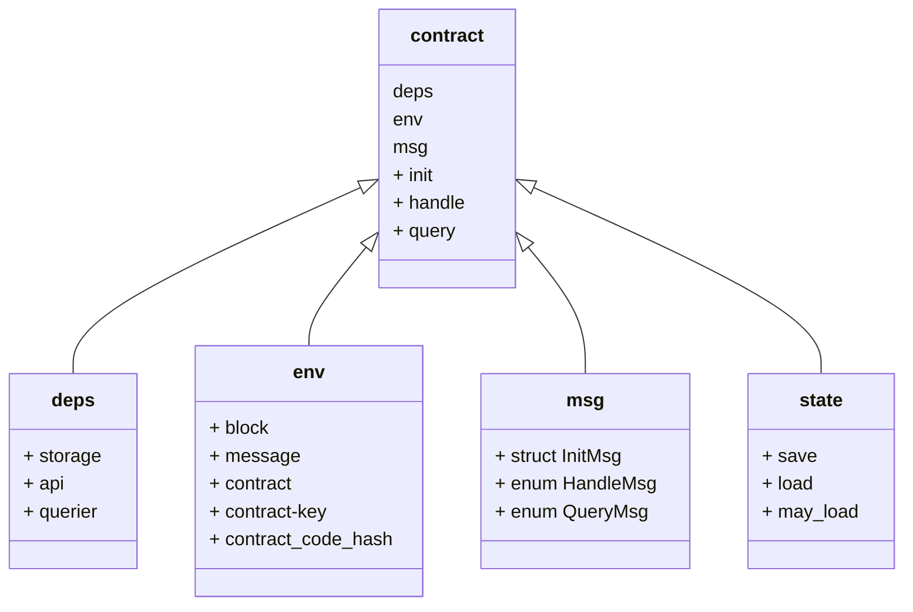

# wasm合约开发指导书

### 	一、 准备工作

> - rust开发环境运行常
> - 区块链运行正常，相应的rpc端口开放
> - 钱包地址的余额充足
> - 有适合的编译器
> - 安装了js包，secretjs、dotenv

### 	二、 开发流程

整体流程

```sequence
note right of 开发者: 根据模板生成项目骨架
开发者->智能合约:开发满足需求的智能合约
note left of 开发者:编写测试用例
开发者->区块链:打包合约，并上传的到链上，获得code-id
开发者->区块链:提供必须参数，初始化相应code-id的智能合约，获得合约地址
用户->智能合约: 向合约中写消息，如铸造一个token
智能合约->区块链: 根据业务逻辑，将数据存入链上的block中，待确认后，合约数据就上链了
用户->智能合约: 根据合约地址，输入相关参数，获取合约中存储的信息，如：token多少，owner是谁等

```

### 	三、目录结构

1. 整体目录结构

```bash
# 根据模板创建一个新的项目
cargo generate --git https://github.com/scrtlabs/secret-template --name <contract_name>
cargo generate --git https://github.com/CosmWasm/cosmwasm-template.git --name <contract_name>
# 目录结构整体如下
➜  mysimplecounter git:(master) ✗ tree
├── Cargo.toml
├── Developing.md
├── Importing.md
├── LICENSE
├── Makefile
├── NOTICE
├── Publishing.md
├── README.md
├── examples
│   └── schema.rs
├── rustfmt.toml
├── schema
		# 合约调用的json文件
│   ├── count_response.json
│   ├── handle_msg.json
│   ├── init_msg.json
│   ├── query_msg.json
│   └── state.json
├── src
		# 合约入口文件，合约初始化、写入和查询逻辑
│   ├── contract.rs 
		# 项目入口文件 
│   ├── lib.rs 
		# 数据结构设定
│   ├── msg.rs 
		# 存储逻辑
│   └── state.rs
└── tests
		# 测试用例
    ├── README.md
    ├── integration.ts
    └── package.json
4 directories, 22 files
# 项目结构主要文件为`contract.rs`,`msg.rs`和`state.rs`
```

#### 	2. 主要文件关联示意图




####  3. 文件介绍

#### 	3.1. `contract.rs`是合约的入口文件，包括操作合约的三个主要功能

> - `init` 是合约的构造函数，只执行一次，用于根据用户提供的参数配置合约
> - `handle` 是向合约中写数据的函数，接受客户端的输入，根据消息内容，分发到不同的逻辑处理单元，并给出不同的响应消息
> - `query` 是从合约中查询信息的函数，根据用户输入的参数分发到不同的处理单元，并最终给出查询结果

```rust
pub fn init<S: Storage, A: Api, Q: Querier>(
    deps: &mut Extern<S, A, Q>,
    env: Env,
    msg: InitMsg,
) -> StdResult<InitResponse> {
    // add init constructor functionality here
}

pub fn handle<S: Storage, A: Api, Q: Querier>(
    deps: &mut Extern<S, A, Q>,
    env: Env,
    msg: HandleMsg,
) -> StdResult<HandleResponse> {
    match msg {
        // add handle transaction execution code here 
    }
}

pub fn query<S: Storage, A: Api, Q: Querier>(
    deps: &Extern<S, A, Q>,
    msg: QueryMsg,
) -> StdResult<Binary> {
    match msg {
        // add query execution code here
    }
}
```

这三个函数的参数是相似的，都有`dpes`，`env`，`msg` 三个参数，每个参数的结构如下 

- `deps` 是包含合约的三个外部依赖的结构

  > - `deps.storage` 实现了从合约的私有存储中的get,set,remove方法
  > - `deps.api` 合约对外提供的方法，目前只实现了两种地址转换的功能
  > - `deps.querier` 实现了合约的查询功能

- `env` 是包含以下有关合约外部状态的信息数据结构

  > - `env.block` 包含当前区块高度、时间我链id的结构体
  > - `env.message` 包含执行合约地址的信息结构，如调用合约者、发送的token等
  > - `env.contract` 可以获取合约的地址
  > - `env.contract-key` 可以获取实例化合约时使用的code-id
  > - `env.contract_code_hash` code-id的16进制 hash

- `msg` 是客户端发送的消息

  > - `InitMsg` 初始化合约的所需参数的结构体
  > - `HandleMsg` 执行合约的枚举消息
  > - `QueryMsg` 查询合约的枚举消息

####  3.2. msg.rs 定义客户端发送的消息格式

```rust
#[derive(Serialize, Deserialize, Clone, Debug, PartialEq, JsonSchema)]
pub struct InitMsg {
    // add InitMsg parameters here
}

#[derive(Serialize, Deserialize, Clone, Debug, PartialEq, JsonSchema)]
#[serde(rename_all = "snake_case")]
pub enum HandleMsg {
    // add HandleMsg types here
}

#[derive(Serialize, Deserialize, Clone, Debug, PartialEq, JsonSchema)]
#[serde(rename_all = "snake_case")]
pub enum QueryMsg {
    // add QueryMsg types here
}
/// Responses from handle function
#[derive(Serialize, Deserialize, Debug, JsonSchema)]
#[serde(rename_all = "snake_case")]
pub enum HandleAnswer {
    // add HandleMsg response types here
}

/// Responses from query function
#[derive(Serialize, Deserialize, Debug, JsonSchema)]
#[serde(rename_all = "snake_case")]
pub enum QueryAnswer {
    // add QueryMsg response types here
}
```

#### 3.3 `state.rs` 定义读取和写入数据到存储的功能

- `save` 将使用store方法序列化一个结构bincode2，并将其写入存储set中

- `load` 用于从存储中检索数据，对其进行反序列化，并返回带有数据的`StdResult`，没有检索到，则返回StdError，

- `may_load` 用于从存储中检索数据，对其进行反序列化，与上一个不同的是，结果是通过`Opation`形式返回，找到时返回Ok,否则返回None

  ```rust
  pub fn save<T: Serialize, S: Storage>(storage: &mut S, key: &[u8], value: &T) -> StdResult<()> {
      storage.set(key, &Bincode2::serialize(value)?);
      Ok(())
  }
  
  pub fn load<T: DeserializeOwned, S: ReadonlyStorage>(storage: &S, key: &[u8]) -> StdResult<T> {
      Bincode2::deserialize(
          &storage
              .get(key)
              .ok_or_else(|| StdError::not_found(type_name::<T>()))?,
      )
  }
  
  pub fn may_load<T: DeserializeOwned, S: ReadonlyStorage>(storage: &S, key: &[u8]) -> StdResult<Option<T>> {
      match storage.get(key) {
          Some(value) => Bincode2::deserialize(&value).map(Some),
          None => Ok(None),
      }
  }
  ```

#### 	3.4  测试用例

```bash
# 目录
├── tests
│   ├── mod.rs
│   ├── unittest_handles.rs
│   ├── unittest_inventory.rs
│   ├── unittest_mint_run.rs
│   ├── unittest_non_transferable.rs
│   ├── unittest_queries.rs
│   └── unittest_royalties.rs
# 运行全部测试用例
cargo test 
# 运行带有handle的测试用例
cargo test handle
```

#### 	3.5 合约json文件

```bash
# 目录
cargo schema
│   ├── count_response.json
│   ├── handle_msg.json
│   ├── init_msg.json
│   ├── query_msg.json
│   └── state.json
# 每个文件代表了对应接口的参数描述
```

#### 	3.6 编译并压缩后的文件 

```bash
make compile-optimized
# 会创建成压缩版的合约文件，contract.wasm.gz
```

### 	四、开发示例

> - 开发一个简易的提醒合约，
> - 初始化合约时，不得超过最大提醒的长度
> - 任何人都应该被查询已存储的条数
> - 允许用户上传提醒内容
> - 存储的内容只允许自己查看，其它人不得访问

##### 	4.1. 	定义msg的消息结构

```rust
# initmsg
pub struct InitMsg {
    pub max_size: i32
}
pub struct InitResponse;
#handleMsg
pub enum HandleMsg {
    Record {
        reminder: String,
    }
}
pub enum HandleAnswer {
    Record {
        status: String,
    }
}
# querymsg结构
pub enum QueryMsg {
    Stats { },
    Read { }
}
pub enum QueryAnswer {
    Stats {
        reminder_count: u64,
    },
    Read {
        status: String,
        reminder: Option<String>,
        timestamp: Option<u64>,
    }
}
```

##### 	4.2	在state中定义存储结构

```rust
#定义一个存储数据的key
pub static CONFIG_KEY: &[u8] = b"config";

#[derive(Serialize, Deserialize, Clone, Debug, PartialEq)]
pub struct State {
    pub max_size: u16,
    pub reminder_count: u64,
}
#[derive(Serialize, Deserialize, Clone, Debug, PartialEq)]
pub struct Reminder {
    pub content: Vec<u8>,
    pub timestamp: u64,
}
```

##### 	4.3	初始化逻辑

```rust
pub fn init<S: Storage, A: Api, Q: Querier>(
    deps: &mut Extern<S, A, Q>,
    _env: Env,
    msg: InitMsg,
) -> StdResult<InitResponse> {
  	//校验输入参数的有效性
		 let max_size = match valid_max_size(msg.max_size) {
        Some(v) => v,
        None => return Err(StdError::generic_err("Invalid max_size. Must be in the range of 1..65535."))
    };
  	// 初始化存储实例
    let config = State {
        max_size,
        reminder_count: 0_u64,
    };
  	//将数据存入链上
  	save(&mut deps.storage, CONFIG_KEY, &config)?;
  	// 给用户返回响应消息
  	Ok(InitResponse::default())
}
fn valid_max_size(val: i32) -> Option<u16> {
    if val < 1 {
        None
    } else {
        u16::try_from(val).ok()
    }
}
```

##### 	4.4	写入逻辑

```rust
pub fn handle<S: Storage, A: Api, Q: Querier>(
    deps: &mut Extern<S, A, Q>,
    env: Env,
    msg: HandleMsg,
) -> StdResult<HandleResponse> {
    match msg {
        HandleMsg::Record { reminder } => try_record(deps, env, reminder),
    }
}
fn try_record<S: Storage, A: Api, Q: Querier>(
    deps: &mut Extern<S, A, Q>,
    env: Env,
    reminder: String,
) -> StdResult<HandleResponse> {
    let status: String;
    let reminder = reminder.as_bytes();

    // retrieve the config state from storage
    let mut config: State = load(&mut deps.storage, CONFIG_KEY)?;

    if reminder.len() > config.max_size.into() {
        status = String::from("Message is too long. Reminder not recorded.");
    } else {
        // get the canonical address of sender
        let sender_address = deps.api.canonical_address(&env.message.sender)?;
        let stored_reminder = Reminder {
            content: reminder.to_vec(),
            timestamp: env.block.time
        };

        save(&mut deps.storage, &sender_address.as_slice().to_vec(), &stored_reminder)?;

        config.reminder_count += 1;
        save(&mut deps.storage, CONFIG_KEY, &config)?;      
        status = String::from("Reminder recorded!");
    }

    // Return a HandleResponse with the appropriate status message included in the data field
    Ok(HandleResponse {
        messages: vec![],
        log: vec![],
        data: Some(to_binary(&HandleAnswer::Record {
            status,
        })?),
    })
}
```

##### 	4.5	查询逻辑

```rust
pub fn query<S: Storage, A: Api, Q: Querier>(
    deps: &Extern<S, A, Q>,
  	env: Env,
    msg: QueryMsg,
) -> StdResult<Binary> {
    match msg {
        QueryMsg::Stats { } => query_stats(deps)
       	QueryMsg::Read { } => try_read(deps, env),
    }
}

fn query_stats<S: Storage, A: Api, Q: Querier>(deps: &Extern<S, A, Q>) -> StdResult<Binary> {
    // retrieve the config state from storage
    let config: State = load(&deps.storage, CONFIG_KEY)?;
    to_binary(&QueryAnswer::Stats{ reminder_count: config.reminder_count })
}
fn try_read<S: Storage, A: Api, Q: Querier>(
    deps: &mut Extern<S, A, Q>,
    env: Env,
) -> StdResult<HandleResponse> {
    let status: String;
    let mut reminder: Option<String> = None;
    let mut timestamp: Option<u64> = None;

    let sender_address = deps.api.canonical_address(&env.message.sender)?;

    // read the reminder from storage
    let result: Option<Reminder> = may_load(&mut deps.storage, &sender_address.as_slice().to_vec()).ok().unwrap();
    match result {
        // set all response field values
        Some(stored_reminder) => {
            status = String::from("Reminder found.");
            reminder = String::from_utf8(stored_reminder.content).ok();
            timestamp = Some(stored_reminder.timestamp);
        }
        // unless there's an error
        None => { status = String::from("Reminder not found."); }
    };

    // Return a HandleResponse with status message, reminder, and timestamp included in the data field
    Ok(HandleResponse {
        messages: vec![],
        log: vec![],
        data: Some(to_binary(&HandleAnswer::Read {
            status,
            reminder,
            timestamp,
        })?),
    })
}
```

### 	五、 通过JS部署合约

##### 	合约部署流程

> - 编译合约得利压缩包
> - 从文件中读取合约文件逻辑
> - 设置各种操作的gas费率
> - 定义所需变量 链 url、account、publickey
> - 初始化网络请求的客户端
> - 上传wasm文件逻辑
> - 构建初始化合约的结构体
> - 使用clien发起初始化操作

##### 	编写合约部署脚本

```javascript
# 创建deploy-nft.js
const {
  EnigmaUtils,
  Secp256k1Pen,
  SigningCosmWasmClient,
  pubkeyToAddress,
  encodeSecp256k1Pubkey,
} = require("secretjs");
require("dotenv").config();
const fs = require("fs");
const customFees = {
  upload: {
    amount: [{ amount: "5000000", denom: "uscrt" }],
    gas: "5000000",
  },
  init: {
    amount: [{ amount: "500000", denom: "uscrt" }],
    gas: "500000",
  },
  exec: {
    amount: [{ amount: "500000", denom: "uscrt" }],
    gas: "500000",
  },
  send: {
    amount: [{ amount: "80000", denom: "uscrt" }],
    gas: "80000",
  },
};

const main = async () => {
  const httpUrl = process.env.SECRET_REST_URL;
  const mnemonic = process.env.MNEMONIC;
  const signingPen = await Secp256k1Pen.fromMnemonic(mnemonic).catch((err) => {
    throw new Error(`Could not get signing pen: ${err}`);
  });
  const pubkey = encodeSecp256k1Pubkey(signingPen.pubkey);
  const accAddress = pubkeyToAddress(pubkey, "secret");

  // 1. Initialize client
	const txEncryptionSeed = EnigmaUtils.GenerateNewSeed();
  const client = new SigningCosmWasmClient(
    httpUrl,
    accAddress,
    (signBytes) => signingPen.sign(signBytes),
    txEncryptionSeed, customFees,
  );
  console.log(`Wallet address=${accAddress}`);
  
  // 2. Upload the contract wasm
	const wasm = fs.readFileSync('my-snip721/contract.wasm');
  console.log('Uploading contract');
  const uploadReceipt = await client.upload(wasm, {})
    .catch((err) => { throw new Error(`Could not upload contract: ${err}`); });
  // Get the code ID from the receipt
  const { codeId } = uploadReceipt;
  
  // 3. Create an instance of the NFT contract init msg
  const initMsg = {
      name: 'mynft',
      symbol: 'ftk',
      entropy: '',
      config: {
          public_owner: true
      },
	}
  // 发起合约的初始化操作
  const contract = await client
    .instantiate(
      codeId,
      initMsg,
      `My Snip721${Math.ceil(Math.random() * 10000)}`
    )
    .catch((err) => {
      throw new Error(`Could not instantiate contract: ${err}`);
    });
  // 得到合约地址
  const { contractAddress } = contract;
  console.log("contract: ", contract, "address:", contractAddress);
};

main().catch((err) => {
  console.error(err);
});
```

开始部署合约

```bash
node deploy-nft.js
# 如果一切顺利，会看到类似输出
Uploading contract
contract:  {
  contractAddress: 'secret1g0t7sggeh89k27xa2vux5rnpc3ly4a9c0u8724',
  logs: [ { msg_index: 0, log: '', events: [Array] } ],
  transactionHash: 'F5E734014EA3108B071B3EA390E58FC41FA0DB28D1F49FE7A652C53E482AA0D9',
  data: '43D7E82119B9CB6578DD53386A0E61C47E4AF4B8'
} address: secret1g0t7sggeh89k27xa2vux5rnpc3ly4a9c0u8724
```

### 	六、 通过cli在链上部署合约

#### 			6.1. 查看链上存储的合约代码

```bash
ghmd query compute list-code
# You will see the output found below after running 'secretd query compute list-code', but with your own "creator" and "data_hash" values.
[
  {
    "id": 1,
    "creator": "secret1zy80x04d4jh4nvcqmamgjqe7whus5tcw406sna",
    "data_hash": "D98F0CA3E8568B6B59772257E07CAC2ED31DD89466BFFAA35B09564B39484D92",
  }
]
```

#### 			6.2. 上传压缩的合约文件到链上

```bash
ghmd tx compute store contract.wasm.gz \
--from ghm1rf77hs79fdzcufh0a8kk35cnamrymhmeq0jk8n \
--gas 3700000 \
--gas-prices 0.25ughm \
--chain-id ghm-testnet
# 查看是否有新的合约信息
ghmd query compute list-code
# 查看合约存储的操作日志
ghmd q compute tx <hash-code>
```

#### 		6.3. 初始化合约

```bash
# 初始化参数为 schema中initial.json中的约定
# 这里的3指的是ghmd query compute list-code 查看中新上传的合约id
ghmd tx compute instantiate 3 '{"name":"fc_token","symbol":"FETH","admin":"ghm1rf77hs79fdzcufh0a8kk35cnamrymhmeq0jk8n","decimals":18,"initial_balances":[{"address":"ghm1rf77hs79fdzcufh0a8kk35cnamrymhmeq0jk8n","amount":"1000000000000000000"}],"prng_seed":"base64_seed","config":{"public_total_supply":true,"enable_deposit":false,"enable_redeem":false,"enable_mint":false,"enable_burn":false}}' \
--label 'fcihpy_erc20'  \
--from ghm1rf77hs79fdzcufh0a8kk35cnamrymhmeq0jk8n \
--chain-id ghm-testnet

# 根据hash-code查看操作日志
ghmd q tx <hash-code>
```

#### 		6.4. 查看合约地址

```bash
ghmd query compute list-contract-by-code 3
[
  {
    "address": "ghm174kgn5rtw4kf6f938wm7kwh70h2v4vcf763ddr",
    "code_id": 3,
    "creator": "ghm1rf77hs79fdzcufh0a8kk35cnamrymhmeq0jk8n",
    "label": "fcihpy_erc20"
  }
]
```

#### 		6.5. 写合约操作

```bash
ghmd tx compute execute <contract-address> '{"send":{"amount": <string>, "recipient": <string>}}'
```

#### 		6.6. 查询合约信息

```bash
ghmd q compute query ghm174kgn5rtw4kf6f938wm7kwh70h2v4vcf763ddr '{"token_info": {}}'
# 返回如下信息
{"token_info":{"name":"fc_token","symbol":"FETH","decimals":18,"total_supply":"1000000000000000000”}}
```
